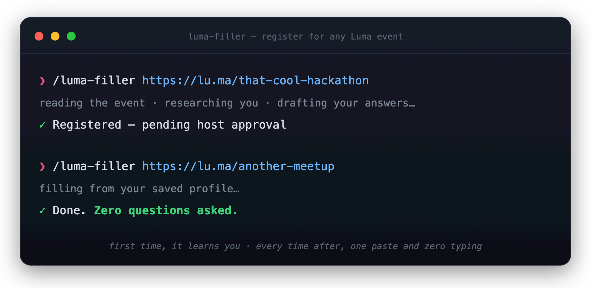

<div align="center">


<h1>Lumate</h1>

<h3><em>Paste a Luma link. It registers you.</em></h3>
<p>Stop filling out the same event form, over and over, forever.</p>

<p>
  <a href="LICENSE"></a>
  &nbsp;
  &nbsp;
  <br><br>
  <a href="https://skills.sh/mohitpaddhariya/lumate"></a>
</p>



</div>

---

It's 11:47pm. You found the perfect hackathon on [Luma](https://lu.ma).

Then the form loads: name, email, phone, LinkedIn, GitHub, job title, *"what have you
built?"*, *"why do you want to attend?"*. For the **tenth time this month**.

**Lumate does it for you.** Paste the link. It reads the event, fills every field from your
profile, writes real answers from your GitHub, and submits.

> [!TIP]
> **It learns you.** The first event teaches it your answers. Every event after registers
> with **zero questions** in a single pass. One paste, zero typing.

## What it does for you

- **Reads the event.** Works out what it's about and what the host is screening for.
- **Fills everything.** Name, email, socials, job title, all from your saved profile.
- **Writes your answers.** *"What have you built?"* answered from your **real GitHub
  projects**, grounded in fact, never made up.
- **Gets faster every time.** It remembers every answer, so repeats go through in one pass.
- **Confirms before submitting.** It only goes hands-off when everything is already known.

<sub>Under the hood: a <code>SKILL.md</code> workflow plus three tiny Python helpers for
answer memory, GitHub research, and a headless Playwright browser. No external services.</sub>

## Get started

> [!NOTE]
> Lumate is a [Claude Code](https://claude.com/claude-code) skill, installable through the
> open [skills](https://skills.sh) ecosystem.

Install it globally with one command:

```bash
npx skills add mohitpaddhariya/lumate -g
```

Then a one-time setup for the headless browser:

```bash
python3 -m venv ~/.lumate/venv && ~/.lumate/venv/bin/pip install playwright
```

Then just hand it a link:

```text
/lumate  https://lu.ma/your-event
```

## Your data, your control

- Everything stays **local** in `~/.lumate/`. Nothing personal lives in this repo.
- It **asks before it submits**, and goes hands-off only when every value is already saved.
- **No CAPTCHA solving.** If a host throws a bot check, it hands off to you. Logged in, you
  won't see one.

<sub>For personal use. Play nice with Luma's Terms of Service.</sub>

---

<div align="center">
Built by <a href="https://github.com/mohitpaddhariya">Mohit Paddhariya</a> · MIT
</div>
